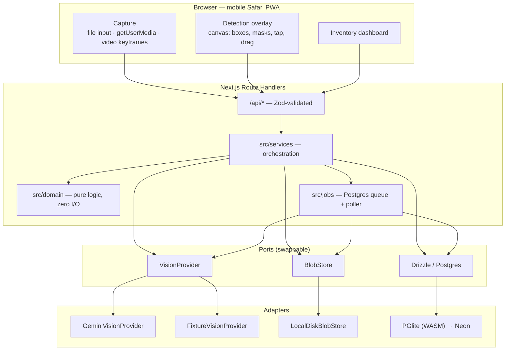

# Sorta — Design Spec

**Date:** 2026-08-06
**Status:** Approved, Phase 1 in implementation

## Problem

People liquidating garages, storage lockers, estates, and moves have piles of
sellable goods and no cheap way to turn them into marketplace listings. The
bottleneck is not selling — it is *inventorying*. Photographing each item,
identifying what it actually is, researching what it is worth, and writing
listing copy costs 10–20 minutes per item. A 60-item storage locker is a
full weekend of unpaid work, so most people either dump the lot to a
liquidator at 5c on the dollar or never sell at all.

Sorta collapses that: point a phone at a room, get a reviewed inventory.

## Product principles

1. **The room photo is the input, not the item photo.** Every competitor makes
   you start with one item. Starting with the scene is the whole wedge.
2. **Never fabricate a fact about someone's property.** Prices, model numbers,
   and condition claims are either sourced or marked unknown. A wrong model
   number on a listing is a dispute; a blank one is a prompt.
3. **The model is a proposer, the user is the decider.** Detections are
   suggestions until promoted. Every AI field is editable and shows provenance.
4. **Escape hatches everywhere.** Missed object → draw a box. Wrong label →
   retype it. Bad crop → recrop. A pipeline that dead-ends on a model miss is
   not usable in a dusty storage unit with one bar of signal.

## Scope

| Phase | Contents | Status |
|---|---|---|
| 1 | Capture → detect → review → promote → inventory | **Building now** |
| 2 | Photo assistant, AI identification, description generation | Specified |
| 3 | Pricing research, listing generation, marketplace export | Specified |

## Architecture



### Why these choices

**Next.js single app, not a split mobile client + FastAPI.** The user has no
Docker, no local Postgres, and Python 3.9. One TypeScript codebase with route
handlers removes an entire deployment axis, and the domain layer stays
framework-free so a separate API server remains extractable.

**PGlite instead of a hosted Postgres.** Real Postgres compiled to WASM,
in-process, zero setup — genuine `jsonb`, arrays, enums, and full-text. Moving
to Neon is a connection-string change. The cost is that PGlite is single-process
and therefore a development/MVP database, not a production deploy target. That
tradeoff is deliberate for Phase 1.

**Client-side video keyframe extraction.** Seeking an `HTMLVideoElement` and
drawing to a canvas avoids an ffmpeg system dependency entirely. Frames are
scored for sharpness and inter-frame difference on-device, so only distinct,
non-blurry frames are uploaded — less bandwidth and fewer wasted detection calls.

**A Postgres-backed job queue.** Detection on a full storage-locker photo takes
10–30s, which cannot live inside a request handler. A `jobs` table plus an
in-process poller needs no Redis and lifts to a standalone worker later without
changing a single call site.

**Detections stay separate from items.** Promotion is an explicit user act. This
is what makes "14 objects found, promote the 6 worth selling" honest, and
dismissals become a labelled signal for future model tuning.

## Data model

Postgres. All ids are `uuid` defaulting to `gen_random_uuid()`. All timestamps
are `timestamptz`. Money is stored as integer cents with an ISO currency code —
never floats.

### Enums

- `lot_kind` — `storage_unit | garage | home | estate | office | other`
- `scan_kind` — `scene | photo | video`
- `scan_status` — `uploaded | processing | complete | failed`
- `item_status` — `detected | photos_needed | ai_identified | needs_confirmation | confirmed | listed | sold | discarded`
- `item_condition` — `new | like_new | excellent | good | fair | poor | for_parts`
- `photo_view` — `front | side | back | top | label | damage | serial | accessories | other`
- `job_status` — `pending | running | complete | failed`
- `marketplace` — `facebook | ebay | craigslist | offerup | generic`

### Tables

**`users`** — `id, email, display_name, created_at`.
Phase 1 uses a single seeded local user; the table exists so adding Auth.js is
purely additive.

**`lots`** — `id, user_id→users, name, kind: lot_kind, location_text, notes,
archived_at, created_at, updated_at`.
The container being liquidated, e.g. "Storage Unit #23".

**`scans`** — `id, lot_id→lots, kind: scan_kind, blob_key, mime_type, width,
height, byte_size, status: scan_status, error, created_at`.
One upload event. For `kind = video`, `blob_key` is null and frames carry the
imagery.

**`scan_frames`** — `id, scan_id→scans, blob_key, t_ms, width, height,
sharpness: real, created_at`.
Keyframes extracted client-side from a walkthrough video.

**`detections`** — `id, scan_id→scans, frame_id→scan_frames (nullable), label,
category, bbox: jsonb, mask_blob_key, confidence: real, source: text,
promoted_item_id→items (nullable), dismissed_at, created_at`.

`bbox` is `{ x, y, w, h }` with all values normalized fractions of image
dimensions in `[0,1]`, origin top-left. This is the single coordinate contract
shared by the Gemini adapter, the canvas renderer, the crop service, and any
future SAM2 adapter. `source` is `model` or `user` so hand-drawn boxes are
distinguishable.

**`items`** — `id, lot_id→lots, title, category, brand, model, condition:
item_condition, condition_notes, dimensions: jsonb, serial_number, user_notes,
estimated_value_cents, currency, status: item_status,
created_from_detection_id→detections, created_at, updated_at`.

`dimensions` is `{ w, h, d, unit, source }` where source is `estimated | user`.

**`item_photos`** — `id, item_id→items, blob_key, view: photo_view, is_primary,
width, height, byte_size, quality: jsonb, created_at`.

`quality` is `{ blurScore, exposure, issues[] }` — populated by the fast
client-side Laplacian check on upload, enriched by the model in Phase 2.

**`identifications`** *(Phase 2)* — `id, item_id→items, provider, product_name,
manufacturer, model, msrp_cents, confidence, sources: jsonb, raw: jsonb,
created_at`. Append-only; the newest row wins, older rows are the audit trail.

**`valuations`** *(Phase 3)* — `id, item_id→items, condition_tier, low_cents,
high_cents, recommended_cents, comparables: jsonb, method, created_at`.

**`listings`** *(Phase 3)* — `id, item_id→items, marketplace, title, description,
price_cents, negotiation_low_cents, category_path, condition_label, status,
created_at`.

**`exports`** *(Phase 3)* — `id, lot_id→lots, marketplace, format, blob_key,
item_count, created_at`.

**`jobs`** — `id, type, payload: jsonb, status: job_status, attempts,
max_attempts, last_error, run_after, locked_at, created_at, updated_at`.
Indexed on `(status, run_after)` for the poller's claim query.

### Item status machine

```
detected ─┬─> photos_needed ──> ai_identified ──> needs_confirmation ──> confirmed ──> listed ──> sold
          └─> discarded
```

Transitions are validated by a pure function in `src/domain/item-status.ts`.
Phase 1 exercises `detected → photos_needed → needs_confirmation → confirmed`;
`ai_identified` is entered by the Phase 2 identification job.

## AI layer

A single port, implemented once per vendor:

```ts
interface VisionProvider {
  readonly name: string
  detectObjects(input: DetectObjectsInput): Promise<DetectedObject[]>
  assessPhotoQuality(input: AssessQualityInput): Promise<PhotoQuality>
  identifyItem(input: IdentifyItemInput): Promise<Identification>       // Phase 2
  researchValue(input: ResearchValueInput): Promise<ValuationDraft>     // Phase 3
  generateListing(input: GenerateListingInput): Promise<ListingDraft>   // Phase 3
}
```

`GeminiVisionProvider` is the Phase 1 implementation. Every call:

1. sends a `responseSchema` for structured output,
2. parses the response through a Zod schema at the boundary,
3. converts Gemini's `[ymin, xmin, ymax, xmax]` 0–1000 integer boxes into the
   normalized `{x, y, w, h}` 0–1 contract,
4. retries with exponential backoff on 429/5xx only.

`FixtureVisionProvider` replays recorded JSON responses. It backs the entire
test suite (no network, no key) and powers demo mode, so the app is fully
explorable with `GEMINI_API_KEY` unset.

## API

All routes are Zod-validated on input and return typed JSON. Errors use a
consistent `{ error: { code, message, details? } }` envelope.

| Method | Path | Purpose |
|---|---|---|
| `GET/POST` | `/api/lots` | list / create lots |
| `GET/PATCH/DELETE` | `/api/lots/:lotId` | lot detail with item counts by status |
| `POST` | `/api/lots/:lotId/scans` | multipart upload; enqueues `detect_objects` |
| `GET` | `/api/scans/:scanId` | scan status + detections |
| `POST` | `/api/scans/:scanId/frames` | attach video keyframes |
| `POST` | `/api/detections/:detectionId/promote` | crop region → create item |
| `POST` | `/api/detections/:detectionId/dismiss` | dismiss a detection |
| `PATCH` | `/api/detections/:detectionId` | edit label/bbox |
| `POST` | `/api/scans/:scanId/detections` | add a hand-drawn detection |
| `GET/POST` | `/api/lots/:lotId/items` | inventory list / manual item |
| `GET/PATCH/DELETE` | `/api/items/:itemId` | item detail |
| `POST` | `/api/items/:itemId/photos` | upload item photo with view tag |
| `DELETE` | `/api/photos/:photoId` | remove photo |
| `GET` | `/api/jobs/:jobId` | job status for client polling |
| `GET` | `/api/blobs/:key` | serve stored image |

Phase 3 adds `POST /api/lots/:lotId/exports` returning a CSV or ZIP blob.

## Screens (Phase 1)

1. **Lots** — list with item counts and a create sheet.
2. **Lot dashboard** — inventory grouped by status, matching the brief's
   vocabulary ("Photos needed", "AI identified", "Needs confirmation"), with a
   prominent Capture action.
3. **Capture** — three tabs: Scene photo, Multiple photos, Video walkthrough.
   Guided coaching copy per mode. Video mode extracts and previews keyframes
   before upload.
4. **Detection review** — the core screen. Pinch-zoomable image, translucent
   masks, labeled tappable boxes, a confidence-sorted bottom sheet, drag-to-draw
   for missed objects, and dismiss.
5. **Item detail** — photo grid with view tags, editable fields, coverage
   checklist showing which views are still missing, notes.

## Testing

- **Unit (Vitest)** — every `src/domain` module: bbox geometry and crop math,
  coverage rules, status machine, quality scoring. Pure functions, zero mocks.
- **Integration** — route handlers against a fresh in-memory PGlite per suite
  with migrations applied. Real SQL, real constraints, no database mocking.
- **AI adapter** — `GeminiVisionProvider` parsing and coordinate conversion
  tested against recorded fixture payloads, including malformed responses.
- **E2E (Playwright)** — one happy path: upload fixture scene → detections
  render → tap a box → item appears in the inventory.

## Deliberate omissions in Phase 1

- **No auth.** Single implicit local user. Additive to add later.
- **No estimated value.** Shown as "Not yet priced" rather than a fabricated
  number; real pricing arrives with the Phase 3 research pipeline.
- **No segmentation masks.** Detection returns boxes only. Requesting base64
  masks alongside fifteen objects in one structured response risks truncation,
  and a truncated response is a *total* detection failure rather than a
  degraded one — the worst possible trade in a flow the user is standing still
  waiting for. Per-object masks belong in Phase 2, fetched on demand for a
  single promoted item. The `detections.mask_blob_key` column, the provider
  interface, and the overlay renderer already carry mask support.
- **No embeddings / vector search.** The schema leaves room; nothing in Phase 1
  needs semantic inventory search.
- **No offline queue.** Storage units have poor signal and this matters, but it
  is a Phase 2 concern once the core loop is proven.
